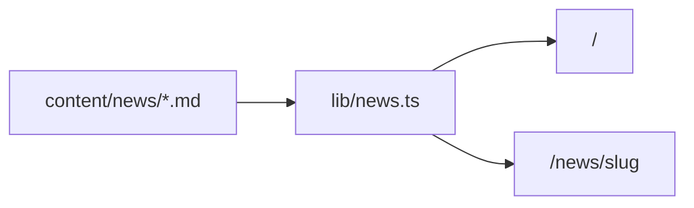

# 출근한입 (chulgeun-han-ip)

IT 뉴스를 **짧게 요약**해 보는 개인 블로그입니다. 출근 전후에 한두 편 읽기 좋은 톤으로, 메인에서는 카드 목록을 보고 상세는 **마크다운 본문**으로 읽습니다.

**DB·CMS 없이** `content/news/*.md`만 Git에 두고 빌드·배포합니다. 글 추가는 파일 하나 + push면 되어 **유지보수 부담이 작습니다** (Supabase·크론 의존 블로그와 대비).

## Links

| | |
|---|---|
| **Live** | https://chulgeun-han-ip.vercel.app |
| **Repository** | https://github.com/kwaneung/chulgeun-han-ip |

## Highlights

- **콘텐츠** — `content/news/` Markdown + Frontmatter (`gray-matter`), slug = URL
- **렌더링** — Server Components, `react-markdown` + GFM, `generateStaticParams` SSG
- **UI** — 뉴스 카드, Container Queries, react-bits·Motion 히어로
- **테마** — OS `prefers-color-scheme`만 (`SystemThemeLock`, 수동 토글 없음)
- **선택** — `/api/weather` (OpenWeather, env 없으면 503)
- **배포** — Vercel + GitHub 연동, React Compiler

## Stack

| 구분 | 기술 |
|------|------|
| Framework | Next.js 16 (App Router), React 19, TypeScript |
| Style | Tailwind CSS v4, typography, container-queries |
| Content | Markdown, gray-matter, react-markdown, remark-gfm |
| Theme | next-themes (system only) |
| Deploy | Vercel, pnpm |

## 콘텐츠·운영 (DB 없음)



| | 파일 기반 (이 레포) | DB 블로그 (예: devnest) |
|---|---------------------|-------------------------|
| 글 추가 | `.md` 작성 → commit → deploy | DB/API·키·pause 이슈 가능 |
| 인프라 | Vercel + Git만 | Supabase 등 |
| 빌드 | 새 slug는 `generateStaticParams`로 정적 생성 | 런타임·캐시 정책에 따름 |

## Project structure

```
app/
  page.tsx              # 뉴스 목록
  news/[slug]/          # 상세 + generateStaticParams
  api/weather/          # 헤더 날씨 (선택)
components/
  NewsCard.tsx, MarkdownBody.tsx, HomeHeroSection.tsx, …
content/news/           # 글 원본 (Frontmatter 필수)
lib/news.ts             # fs 읽기·목록·단건
```

## 새 글 추가

`content/news/<slug>.md`:

```yaml
---
title: "제목"
summary: "목록 한 줄 요약"
date: "2026-03-28"
category: "태그"
---

본문 마크다운
```

파일명(확장자 제외) = `/news/<slug>`.

```bash
git add content/news/my-article.md
git commit -m "content: add my-article"
git push   # Vercel 자동 배포
```

## Local development

```bash
pnpm install
pnpm dev      # http://localhost:3000
pnpm build
pnpm lint
```

선택 env (`.env.local`):

```env
OPENWEATHER_API_KEY=   # 없으면 날씨 API만 503
```

## Status

| | |
|---|---|
| **Role** | 개인 IT 요약 블로그 · Public · Pin 후보 |
| **Maintenance** | MD 추가 + 배포 중심, DB/크롤 불필요 |
| **License** | 개인 프로젝트 · 콘텐츠 출처는 글마다 상이 |
