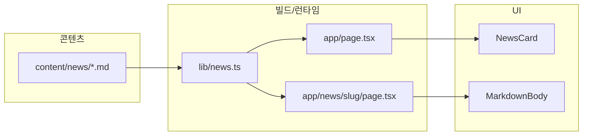

# 출근한입 (chulgeun-han-ip)

IT 뉴스를 **짧게 요약**해 보는 개인 블로그입니다. 메인에서는 카드 형태의 「오늘의 요약 뉴스」를 보고, 카드를 누르면 **마크다운 본문**을 읽을 수 있습니다. 출근 전후에 한두 개씩 읽기 좋은 톤과 레이아웃을 목표로 합니다.

**배포:** [https://chulgeun-han-ip.vercel.app/](https://chulgeun-han-ip.vercel.app/)  
**저장소:** [https://github.com/kwaneung/chulgeun-han-ip](https://github.com/kwaneung/chulgeun-han-ip)

---

## 기술 스택

| 구분 | 사용 기술 |
|------|-----------|
| 프레임워크 | [Next.js](https://nextjs.org) 16 (App Router) |
| 언어 | [TypeScript](https://www.typescriptlang.org/) |
| 스타일 | [Tailwind CSS](https://tailwindcss.com) v4, [@tailwindcss/typography](https://github.com/tailwindlabs/tailwindcss-typography) |
| 패키지 매니저 | [pnpm](https://pnpm.io/) |
| 콘텐츠 | 파일 기반 마크다운 + [gray-matter](https://github.com/jonschlinkert/gray-matter) (Frontmatter) |
| 렌더링 | [react-markdown](https://github.com/remarkjs/react-markdown), [remark-gfm](https://github.com/remarkjs/remark-gfm) |
| 테마 | [next-themes](https://github.com/pacocoursey/next-themes) — **시스템 설정만** 따름 (수동 라이트/다크 전환 UI 없음) |
| 빌드 최적화 | [React Compiler](https://react.dev/learn/react-compiler) (`babel-plugin-react-compiler`, `next.config`에서 활성화) |
| 반응형 | **CSS Container Queries** — 뉴스 카드는 부모(`@container`) 너비 기준으로 `@md:` 등 적용 ([@tailwindcss/container-queries](https://github.com/tailwindlabs/tailwindcss-container-queries) + `tailwind.config.ts`) |
| 배포 | [Vercel](https://vercel.com) (GitHub 연동) |

---

## 아키텍처

### 전체 흐름



- **데이터 소스:** `content/news/` 아래의 `.md` 파일만 사용합니다. Git에 포함되는 정적 콘텐츠이므로 별도 DB나 CMS가 없습니다.
- **데이터 접근:** `lib/news.ts`가 Node `fs`로 마크다운을 읽고, Frontmatter를 파싱해 목록용 메타와 본문을 분리합니다.
- **라우팅:** App Router에서 `/`는 목록, `/news/[slug]`는 상세입니다. `generateStaticParams`로 빌드 시 정적 경로를 생성합니다.
- **렌더링:** 목록·상세 페이지는 기본적으로 서버 컴포넌트입니다. 마크다운은 `MarkdownBody`에서 `react-markdown`으로 HTML로 변환됩니다.
- **테마:** `Providers` + `SystemThemeLock`으로 저장된 수동 테마를 덮어 쓰고, OS `prefers-color-scheme`에 맞춰 `html`에 `light` / `dark` 클래스가 붙습니다. Tailwind는 `@custom-variant dark`로 클래스 기준 다크 모드를 사용합니다.

### 디렉터리 개요

```
app/
  layout.tsx          # 루트 레이아웃, Geist 폰트, Providers, 헤더/푸터
  page.tsx            # 메인 — 뉴스 목록
  globals.css         # Tailwind 엔트리, @config, @plugin, 다크 variant, CSS 변수
  news/[slug]/        # 상세 페이지 + not-found
components/
  NewsCard.tsx        # 카드 링크 (컨테이너 쿼리 @md:)
  MarkdownBody.tsx    # prose 스타일 + react-markdown
  SiteHeader.tsx
  providers.tsx       # ThemeProvider
  SystemThemeLock.tsx # 항상 system 테마 고정
content/news/         # 마크다운 글 (Frontmatter 필수)
lib/news.ts           # 슬러그 목록, 목록 조회, 단건 조회
tailwind.config.ts    # container-queries 플러그인 (globals.css @config로 로드)
```

---

## 로컬 실행

```bash
pnpm install
pnpm dev
```

브라우저에서 [http://localhost:3000](http://localhost:3000) 을 엽니다.

```bash
pnpm build   # 프로덕션 빌드
pnpm start   # 빌드 결과 실행
pnpm lint    # ESLint
```

---

## 새 글 추가하기

`content/news/<slug>.md` 파일을 만들고 상단에 Frontmatter를 둡니다.

```yaml
---
title: "제목"
summary: "목록에 보일 한 줄 요약"
date: "2026-03-28"
category: "태그"
---

본문은 마크다운으로 작성합니다.
```

파일 이름(확장자 제외)이 URL의 `slug`가 됩니다 (`/news/<slug>`).

---

## 라이선스

개인 프로젝트입니다. 콘텐츠의 출처·인용은 각 글의 맥락에 따릅니다.
